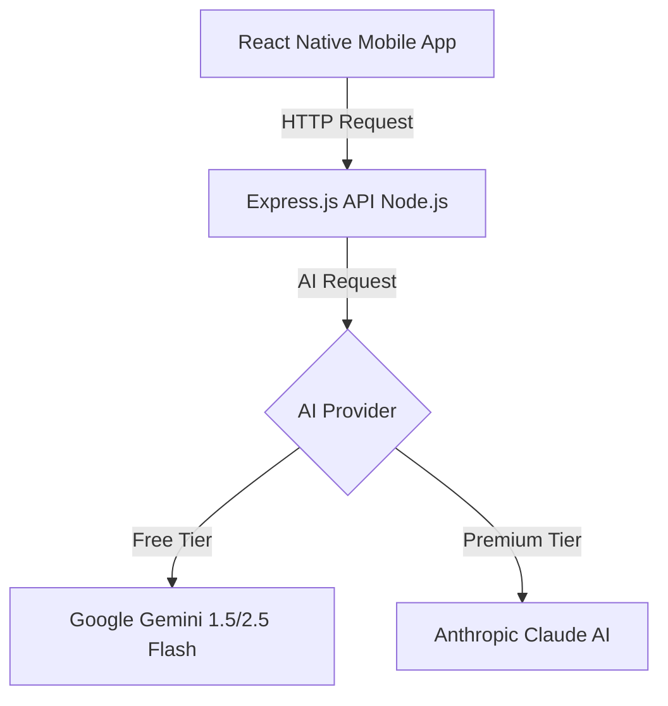

# AI Keyboard Assistant 🤖⌨️

An AI-powered mobile app that helps you respond to messages quickly and contextually. Built for WhatsApp, Telegram, and all messaging platforms!

---

## 🌟 Features

- ✅ **AI-Powered Suggestions**: Get 3 contextually relevant response options instantly.
- ✅ **Multi-Tone Support**: Choose between **Casual**, **Professional**, and **Brief** responses.
- ✅ **Multi-Language (Hinglish)**: Native support for English, Hindi, and natural **Hinglish** (Hindi-English mix).
- ✅ **Privacy-First**: No message storage, encrypted API communication.
- ✅ **Usage Tracking**: Built-in logic for Free Tier (Daily Limits) and Pro users.

---

## 🏗️ Architecture



---

## 🚀 Quick Start (Free Version - Gemini)

Currently, the project is configured to use **Google Gemini** as it offers a generous **Free Tier (1500 requests/day)** with no credit card required.

### 1. Prerequisites
- Node.js 18+
- Android Studio (for Mobile App)

### 2. Backend Setup
1. **Navigate to backend folder**:
   ```bash
   cd backend
   ```
2. **Install dependencies**:
   ```bash
   npm install
   ```
3. **Configure Environment**:
   - Create a `.env` file in the `backend` folder.
   - Add your Gemini API Key (Get it from [Google AI Studio](https://aistudio.google.com/apikey)):
     ```env
     PORT=3000
     GEMINI_API_KEY=YOUR_FREE_KEY_HERE
     ```
4. **Start Server**:
   ```bash
   npm run dev
   ```

### 3. Frontend Setup
1. **Navigate to frontend folder**:
   ```bash
   cd frontend
   ```
2. **Install dependencies**:
   ```bash
   npm install
   ```
3. **Run App**:
   ```bash
   npx react-native start
   # Then press 'a' for Android
   ```

---

## 💎 Coming Soon: Claude AI Integration

While we currently use Gemini for the free tier, the project is architected to support **Anthropic's Claude AI** for "Pro" users who want:
- Higher response intelligence & nuance.
- Larger context windows.
- More consistent tone matching.

To switch to Claude, simply update the `route` to point to the `claude.service.js` and provide an `ANTHROPIC_API_KEY`.

---

## 🔒 Security & Privacy
- **Stateless API**: Message content is processed in real-time and never saved to a database.
- **Robust Parsing**: Custom JSON extraction ensures the app never crashes due to AI formatting quirks.
- **Rate Limiting**: Built-in protection against API abuse.

---

## 🤝 Contributing
Feel free to fork this project and submit a Pull Request! Made with ❤️ for better conversations.
