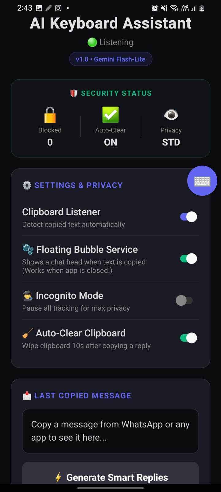
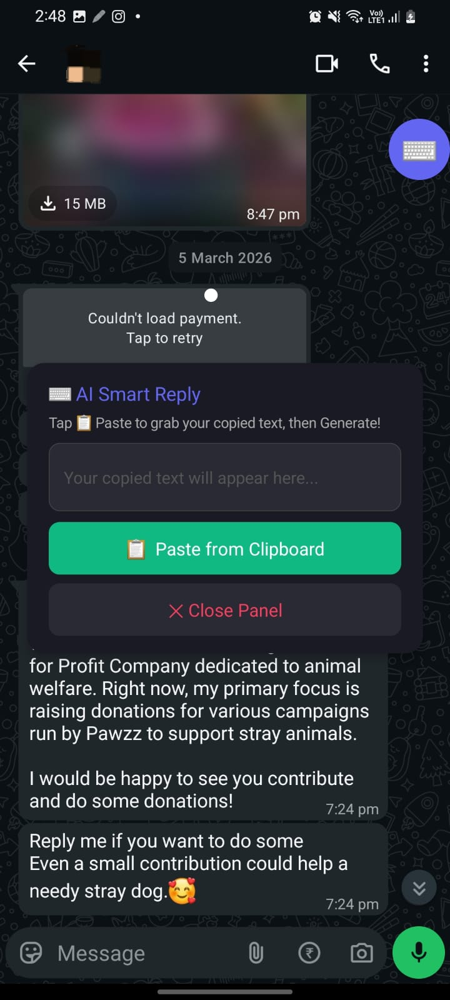
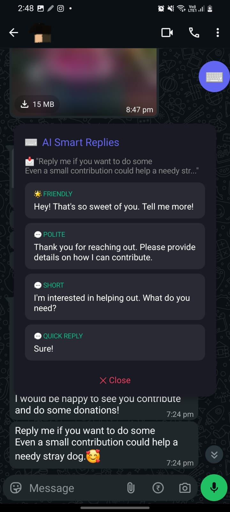

<div align="center">
  
# Replyfy - V1.1.0 Beta
*Never type another boring reply again*

[](https://replyfy.onrender.com) 
[](https://github.com/aryankumarx/replyfy/releases)

</div>

## 📸 See It In Action

*Seamless floating interface over WhatsApp, Telegram, and SMS*

| Active Chat Environment | Context-Aware Bubble | Instant AI Generation |
|-------------------------|---------------------|----------------------|
|  <br> <small>*Reading messages*</small> |  <br> <small>*Hit Bubble*</small> |  <br> <small>*4 instant suggestions*</small> |

---


## Overview

Replyfy is a native Android floating bubble that generates contextual AI responses for chat applications. Built with Google Gemini 2.5 Flash and a custom Node.js Express backend, it overlays WhatsApp, Telegram, and SMS to provide instant reply suggestions without app switching.

---

## Version History

| Version | Date | Size | Key Changes |
|---------|------|------|-------------|
| **v1.1.0 Beta** | Apr 2026 | 25MB | ProGuard compression (75% size reduction), ClipboardGrabberActivity, security hardening |
| v1.0.0 | Mar 2026 | 104MB | Initial stable release |

**Latest:** [v1.1.0 Beta APK (25MB)](https://github.com/aryankumarx/replyfy/releases/download/v1.1.0-beta/Replyfy.apk)

---

## What's New in V1.1.0

- **25MB APK** - ProGuard compression reduced size from 104MB to 25MB (75% reduction)
- **ClipboardGrabberActivity** - Bypasses Android 10+ background clipboard restrictions using 1x1 pixel foreground service
- **Ghost Activity** - Eliminates persistent "Displaying over other apps" OS warnings
- **local.properties** - API keys secured outside source code
- **WindowManager.removeView()** - Clean floating bubble lifecycle management

---

## Features

### Floating Architecture
- Context-aware activation via AccessibilityService (only appears in chat apps)
- Auto-generates replies when clipboard text detected during typing
- Instant paste execution without leaving conversation

### Privacy & Security
- Regex blocks sensitive data (passwords, `sk-` API keys, `ghp-` tokens, JWTs)
- Zero-storage backend proxy - no databases, no logging
- 10 requests/minute IP rate limiting with Helmet.js headers
- Automatic clipboard clearing after 10 seconds

### Language & Tone Support
| Tone | Length | Languages |
|------|--------|-----------|
| Casual | Full | English, Hindi, Hinglish |
| Professional | Full | English, Hindi |
| Brief | Short | English, Hindi, Hinglish |
| Quick | 1-3 words | All |

---

## Tech Stack

| Component | Technology |
|-----------|------------|
| **Frontend** | React Native 0.73 + Kotlin Native Modules |
| **Backend** | Node.js 18+ + Express.js |
| **AI Engine** | Google Gemini 2.5 Flash |
| **Native** | Kotlin (`WindowManager`, `AccessibilityService`) |
| **Security** | Helmet.js, express-rate-limit, express-validator |
| **Deployment** | Render.com |

---


## Installation

### Prerequisites
- Android Studio (API 34+ SDK)
- Node.js 18+
- [Free Gemini API key](https://aistudio.google.com/)

### Backend Setup
```bash
git clone https://github.com/aryankumarx/replyfy.git
cd replyfy/backend
npm install
cp .env.example .env
# Edit .env: add GEMINI_API_KEY=your_key_here
npm run dev
```

### Android Development
```bash
cd replyfy/AIKeyboardMobile
npm install
# Create android/local.properties:
# API_URL=https://your-render-url.onrender.com
# API_KEY=your-secret-key
npx react-native run-android
```

### Build Release APK
```bash
cd replyfy/AIKeyboardMobile/android
./gradlew assembleRelease
# Output: app/build/outputs/apk/release/app-release.apk
```

---

## Known Issues

- First API request: 2-3 seconds (Render.com cold start)
- Background monitoring requires app running in foreground
- Android 10+ clipboard restrictions bypassed via foreground service

---

## Roadmap

### V1.2.0 (Next)
- Background clipboard service (true background operation)
- Voice-to-text input integration
- Custom tone builder
- Conversation history & favorites

### V2.0.0 (Future)
- Claude AI integration (premium)
- Browser extension

---

## Contributing

1. Fork the repository
2. Create feature branch: `git checkout -b feature/YourFeature`
3. Commit changes: `git commit -m "Add YourFeature"`
4. Push: `git push origin feature/YourFeature`
5. Open Pull Request


---
## Support

- [Documentation](README.md)
- [Discussions](https://github.com/aryankumarx/replyfy/discussions)
- [Bug Reports](https://github.com/aryankumarx/replyfy/issues)
- Email: aryanvoid505@gmail.com


## License

[MIT License](LICENSE) - Free to use, modify, and distribute.

---

<div align="center">

**Made by Aryan Kumar**

<a href="https://github.com/aryankumarx"></a>
</div>