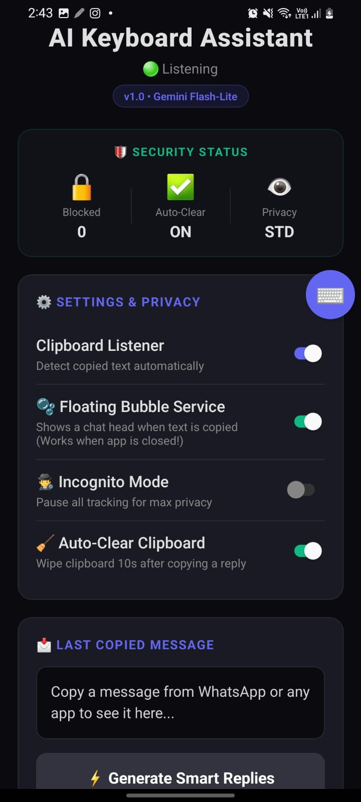
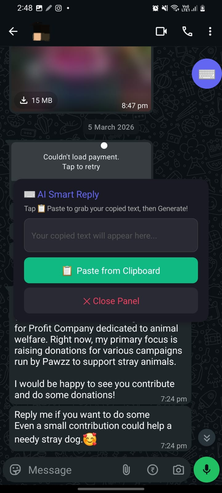
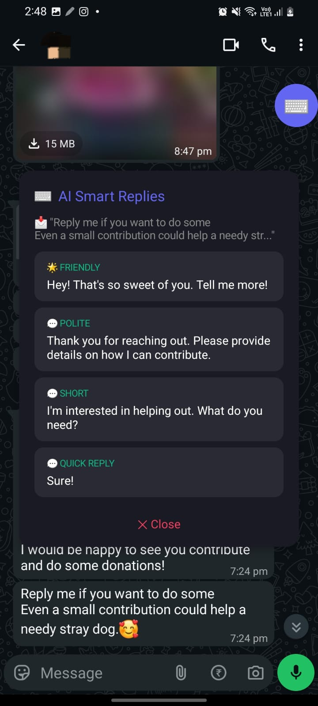

<div align="center">

# Replyfy - v1.4.0
*Never type another boring reply again*

[](https://replyfy.onrender.com)
[](https://github.com/aryankumarx/replyfy/releases)

</div>

---

## Screenshots

| Active Chat | Floating Overlay | AI Suggestions |
|-------------|------------------|----------------|
|  |  |  |

---

## Overview

Replyfy is a native Android floating overlay that generates contextual AI responses directly over WhatsApp, Telegram, and SMS without app switching. Built with React Native, Kotlin Native Modules, and Google Gemini 2.5 Flash-Lite via a Node.js Express proxy.

---

## Key Features

- **Context-Aware Floating Bubble**: Uses AccessibilityService to display overlay only inside messaging applications.
- **7 Smart Tones**: Gen Z, Sarcastic, Sweet, Professional, Decline, Quick Reply, and Playful (Rizz/Shayari).
- **Multi-Language Support**: Automatically detects English, Hindi, and Hinglish.
- **Privacy First**: Local regex sanitization blocks passwords, API keys (`sk-`, `ghp_`, `AIza`), and tokens before sending requests. Zero database logging.
- **Quota & Anti-Crash Resilience**: Exponential backoff (4s to 64s retry window) to handle free-tier API rate limits gracefully.

---

## Supported Tones

| Tone | Description | Languages |
|------|-------------|-----------|
| **Gen Z** | Internet slang and trending abbreviations | English, Hinglish |
| **Sarcastic** | Witty comebacks and dry humor | English, Hinglish |
| **Sweet** | Empathetic and warm responses | English, Hindi |
| **Professional** | Formal, polished, and courteous | English, Hindi |
| **Decline** | Polite refusals and boundary setting | English, Hindi |
| **Quick** | Ultra-short (1–5 words) | All |
| **Playful** | Flirty, poetic, Shayari, and rizz-style | English, Hinglish, Hindi |

---

## Tech Stack

| Layer | Technology |
|-------|------------|
| **Frontend** | React Native 0.73, TypeScript |
| **Native Android** | Kotlin (`WindowManager`, `AccessibilityService`) |
| **Backend** | Node.js 18+, Express.js |
| **AI Engine** | Google Gemini 2.5 Flash-Lite |
| **Security** | Helmet.js, express-rate-limit |
| **Hosting** | Render.com |

---

## Setup & Installation

### Prerequisites
- Android Studio (SDK API 34+)
- Node.js 18+
- [Free Gemini API key](https://aistudio.google.com/)

### Backend Setup
```bash
cd backend
npm install
cp .env.example .env
# Set GEMINI_API_KEY in .env
npm run dev
```

### Mobile App Development
```bash
cd AIKeyboardMobile
npm install
# Create android/local.properties with API_URL and API_KEY
npx react-native run-android
```

### Build Release APK
```bash
cd AIKeyboardMobile/android
./gradlew assembleRelease
```
Output: `AIKeyboardMobile/android/app/build/outputs/apk/release/app-release.apk`

---

## License

[MIT License](LICENSE) - Free to use, modify, and distribute.

---

<div align="center">

**Made With ❤️ by Aryan Kumar**

<a href="https://github.com/aryankumarx"></a>
</div>